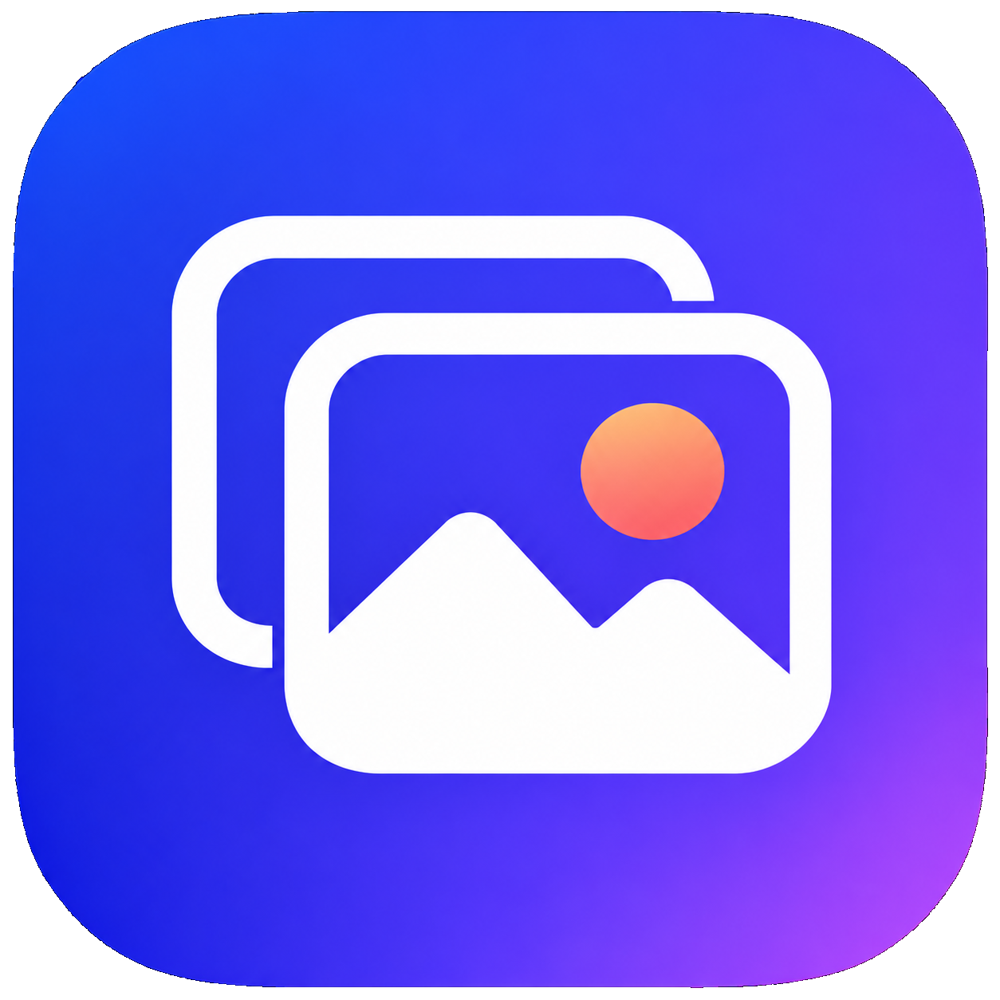

<p align="center">
  
</p>

<h1 align="center">Hello Gallery</h1>

<p align="center">
  A desktop-first photo and video gallery for browsing local media with a fast,
  customizable interface.
</p>

## Overview

Hello Gallery is a Flutter desktop application for Windows and macOS. It keeps
media on the local machine, remembers the selected gallery folder, and combines
folder navigation, multiple gallery layouts, image viewing, and video playback
in one interface.

The project is currently under active development. Windows is the primary
development target, with macOS-specific folder permissions and native media
support included in the codebase.

## Highlights

- Browse local folders with breadcrumb, history, and expandable tree navigation.
- Display media using grid, aspect-ratio grid, quilted, or masonry layouts.
- Sort items by natural filename order or modification date.
- Adjust thumbnail size, spacing, corner radius, labels, and folder previews.
- Select, rename, move, group, and send media or folders to the native trash.
- Preview images with pan, zoom, rotation, fullscreen, and adjacent preloading.
- Play videos using `media_kit` with custom controls, looping, mute, HDR toggle,
  rotation, clean view, and a navigable filmstrip.
- Show cached video thumbnails and timestamp-aware seek preview frames.
- React to filesystem changes without requiring a manual gallery reload.
- Use light, dark, or system appearance with configurable color themes.
- Navigate using keyboard, mouse, or an Xbox-style/PlayStation-style gamepad.

## Supported media

| Type | Extensions |
| --- | --- |
| Images | `.jpg`, `.jpeg`, `.png`, `.gif`, `.webp`, `.bmp`, `.heic`, `.tif`, `.tiff` |
| Videos | `.mp4`, `.mkv`, `.mov`, `.avi`, `.webm`, `.m4v`, `.wmv` |

Actual decoding support can also depend on the operating system and bundled
media libraries.

## Requirements

- Flutter SDK compatible with Dart `^3.10.4`
- Windows 10/11 with Visual Studio C++ desktop development tools, or
- macOS with Xcode and CocoaPods

Check the local toolchain before running the project:

```sh
flutter doctor
```

## Getting started

```sh
flutter pub get
```

Run on Windows:

```sh
flutter run -d windows
```

Run on macOS:

```sh
flutter run -d macos
```

On first launch, choose a root folder containing the media library. The choice
and gallery appearance preferences are persisted locally. On macOS, folder
access is restored using security-scoped bookmarks.

## Controls

### Gallery

| Input | Action |
| --- | --- |
| Arrow keys | Move the active gallery selection |
| `Enter` or `Space` | Open the selected folder or media item |
| `Ctrl/Cmd + A` | Select or clear all visible media |
| `Ctrl/Cmd + +` / `Ctrl/Cmd + -` | Increase or decrease gallery item size |
| `S` | Show or hide the sidebar |
| `F` | Enter or leave fullscreen |
| `Escape` | Leave fullscreen or navigate back |
| Browser Back/Forward or mouse side buttons | Navigate folder history |

### Media preview

| Input | Action |
| --- | --- |
| `Up` / `Down` | Open the previous or next media item |
| `Left` / `Right` | Seek video backward or forward by three seconds |
| `Space` | Play or pause video |
| `M` | Mute or unmute video |
| `R` | Rotate clockwise |
| `Ctrl/Cmd + R` | Lock or unlock rotation |
| `L` | Toggle video loop |
| `G` | Show or hide the media filmstrip |
| `S` | Show or hide the sidebar |
| `T` | Show or hide the top bar |
| `H` | Toggle clean preview mode |
| `F` | Enter or leave fullscreen |
| `Escape` | Leave fullscreen or close the preview |
| Mouse wheel | Navigate between media items |
| `Ctrl/Cmd + mouse wheel` | Zoom the active media |

### Gamepad

Gamepad input uses normalized Xbox-style names; PlayStation equivalents are
shown in parentheses.

| Input | Gallery | Media preview |
| --- | --- | --- |
| D-pad | Move selection | Previous/next or seek video |
| `A` (`Cross`) | Open selected item | Play or pause video |
| `B` (`Circle`) | Navigate back | Close preview |
| `X` (`Square`) | — | Mute or unmute |
| `Y` (`Triangle`) / Start | Toggle fullscreen | Toggle fullscreen |
| Back/Select/Share or Touchpad | Toggle sidebar | Toggle sidebar |
| Left trigger (`L2`) | — | Lock or unlock rotation |
| Right trigger (`R2`) | — | Rotate clockwise |
| Left stick click (`L3`) | — | Toggle clean preview mode |
| Left stick | Scroll | Scroll supported surfaces |
| Right stick | Move virtual cursor | Move virtual cursor |
| `RB` (`R1`) | Primary click/drag | Primary click/drag |
| Hold `LB` (`L1`) | Precision cursor movement | Precision cursor movement |
| Right stick click (`R3`) | Recenter virtual cursor | Recenter virtual cursor |

## Build

Create a Windows release bundle:

```sh
flutter build windows --release
```

The executable and all required runtime files are produced in:

```text
build/windows/x64/runner/Release/
```

The entire directory must be distributed together; `hello_gallery.exe` is not
a standalone binary.

### Windows installer

The repository includes an Inno Setup configuration and build helper:

```text
installer/
  build_installer.ps1
  hello_gallery.iss
```

After installing Inno Setup 6 or 7, create the release build and installer with:

```powershell
.\installer\build_installer.ps1
```

The generated installer is written to:

```text
dist/HelloGallery-Setup-<version>.exe
```

The installer version is read from the Windows executable, which in turn is
generated from the `version` field in `pubspec.yaml`.

## Application identity and icons

- Application name: `Hello Gallery`
- Bundle identifier: `com.playground.hellogallery`
- Windows executable: `hello_gallery.exe`

Branding assets are stored separately for documentation and each platform:

```text
docs/assets/hello-gallery-icon.png
windows/runner/resources/app_icon.ico
macos/Runner/Assets.xcassets/AppIcon.appiconset/
```

After replacing the Windows icon, rebuild the application and installer:

```sh
flutter clean
flutter pub get
flutter build windows --release
```

## Architecture

The application uses feature-first organization with presentation,
application, domain, and data boundaries.

```text
lib/
  app/                    App composition, routing, and theme
  core/                   Shared platform and UI infrastructure
  features/
    gallery/              Browsing, selection, organization, and folder tree
    gamepad/              Virtual cursor and normalized gamepad input
    media_index/          Filesystem watching and incremental change handling
    media_preview/        Image/video preview and playback controls
    settings/             Root folder, appearance, and persisted preferences
    thumbnail/            Thumbnail generation, dimensions, scheduling, cache
```

The UI forwards intent to notifiers and application services. Domain types and
rules remain platform-independent, while data sources and repositories isolate
filesystem, preferences, native channels, and media-decoding behavior.

Thumbnail and preview work is scheduled and bounded to keep large galleries
responsive. Generated thumbnails are cached using media identity and file
metadata so modified files invalidate stale results.

## Development checks

Before submitting changes, run:

```sh
dart format lib test
flutter analyze
flutter test
```

The Windows native runner can be verified with:

```sh
flutter build windows --release
```

## Project status

Current development priorities include improving seek-preview responsiveness,
hardening behavior across different video codecs, refining large-library
performance, and expanding platform-level integration tests.
